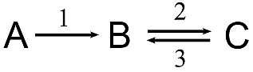

---
jupytext:
  text_representation:
    extension: .md
    format_name: myst
    format_version: 0.13
    jupytext_version: 1.11.5
kernelspec:
  display_name: Python 3 (ipykernel)
  language: python
  name: python3
---

(basic-features)=
# Basic features

+++

## Models

+++

**Kinetic models** are at the heart of S-timator. These models are conceptual descriptions of real systems that are characterized by stating the rates of change of entities.

Generically, a kinetic model is a set of **processes** that produce or consume several **variables**. Variables are required to be associated with a value of *amount* or *concentration*.

Examples of **processes**, from various scientific fields, are:

- a chemical reaction
- the flow of charge in a node of an electrical network
- predation in an ecological system
- the inflow of potassium into the axon of a neuron

Processes are related to change, transport or transformation.

Examples of **variables** are:

- the concentrations of a chemical species
- the number of individuals in the population of prey
- the charge of a capacitor
- the ammount of mRNA transcribed from a gene.

**A key requirement in the formulation of a kinetic model is that the rate the processes is known or can be assigned in advance**.

These rates usually depend on the concentrations of variables and, in turn, affect the concentrations of the variables that are "connected" by them.

But modelling (the act of formulating a model) is **not** about the study of the kinetics of the individual processes.

Instead, the primary objective is to predict or make inferences about the **dynamics of the system as a whole**, in particular to predict the change in the concentrations of the variables considered in the model.

+++

----------

To keep it simple, let's start by looking at the following system of two chemical reactions:



This *reaction scheme* indicates that a chemical species A is transformed into B by reaction 1 and, in turn, B is transformed into C by reaction 2. The arrows mean that reaction 1 is *almost irreversible*, whereas reaction 2 is *reversible*.

+++

If we consider that the **reactions are *processes*** and the **concentrations of the chemical species are the *variables***, we are starting to formulate a kinetic model about this system.

+++

As stated before, a requirement is that the we must indicate the **rates** of the two reactions.

In simple chemical reactions, if the temperature is approximately constant, it is usually assumed that the rates of the individual steps of the reactions have what is called *mass-action kinetics*. In this example, the rates of the reactions would be:
 
$$ v_1 = k_1 \cdot A, \qquad v_2 = k_2 \cdot B - k_3 \cdot C $$

Here, $v_1$ and $v_2$ represent the rates of the reactions 1 and 2, respectively, $A$, $B$ and $C$ represent the concentrations of the chemical species and $k_1$, $k_2$ and $k_3$ are constants appearing in the mathematical expressions of the rates. These constants are called **parameters** of the model.

The values of the parameters must also be indicated in a kinetic model:

$$ k_1 = 0.1, \qquad k_2 = 2, \qquad  k_3 = 1 $$

+++

At the bare minimum, a kinetic model is built by stating:

- how the **variables** are connected by the **processes**
- the **rates** of the processes (how do they depend on the variables)
- the values of the **parameters** that appear in the mathematical expression of the rates.

+++

## Describing models

+++

How can we use S-timator to analyze this simple two-reaction example?

We must start by importing the `S-timator` module. We can import and create a simple alias for `stimator`, say `st`.

```{code-cell} ipython3
import stimator as st
```

In S-timator, models are described inside a *Python string*:

```{code-cell} ipython3
model_description = """

title A two-reaction chemical system

r1: A -> B, rate = k1 * A
r2: B -> C, rate = k2 * B - k3 * C

k1 = 0.1
k2 = 2
k3 = 1

init: (A = 1)

"""
```

This (multi-line) *Python string* contains a set of declarations about the model that are quite straightforward to learn and use.

Let us examine them:

- The **title** is a line is that begins with the word `title` and is supposed to contain a small description of the model.
- The **processes** are lines that describe the processes by indicating the "stoichiometry" of the the processes (that is, how they connect the variables of the model) and the rates of those processes. In this example, consider the line
```
r1: A -> B, rate = k1 * A
```
The format of these lines is: **the name of the process** (`r1`), followed by a **collon**, followed by the **"stoichiometry"** of the process ("`A -> B`") followed by a **comma** and a statement of the **rate** ("`rate = k1 * A`"). So, this line says that reaction `r1` transforms `A` into `B` with rate  `k1 *A`.

- The **parameters** are lines that indicate the values of the parameters of the model. The format is, simply, the **name** of the parameter, followed by an equal sign, followed by the **value** of the parameter.

- The **initial state** is a line that starts with `init:`, followed by a list of values for the variables of the model. These values are supposed to prescribe a state of the model that can serve as an initial (multi-dimensional) starting point from which the dynamics of the system evolves. More about this ahead. In this example, we are setting a value of 1 for variable `A`. The other variables, `B` and `C` will be zero, the default.

Note that, in this example, reaction 1 was named `r1` and the reactions 2 and 3 are considered the forward and backward steps of reaction `r2`.

+++

After writting the *string* that describes the model, this *string* must be transformed into a special *Python* object using function `read_model()`.

```{code-cell} ipython3
m = st.read_model(model_description)
```

The result of `read_model()` is a **`Model`** object, one of the fundamental data structures in `S-timator`.

`Model` objects expose a lot of functionality related to the computational study of kinetic models.

We can `print()` a `Model` object, generating a small report of the components of the model.

```{code-cell} ipython3
print(m)
```

Just a few notes:

- Variables are not declared: they are infered from the "stoichiometry" of the processes.
- Processes must be given a name. Many things that you can do with a `Model` depend on that. In this example, the two reactions were called "`r1`" and "`r2`". Names must begin with a letter and can not have spaces. (we could **not** have given the names "1" and "2" to the two reactions).
- The "`rate =`" part in the declarations of the processes can be dropped: we could just have written "`r1: A -> B, k1 * A`" for  reaction `r1`.

+++

## Solving and plotting


One of the most basic procedures that one can do with a model is to "solve" it and then plot the results.

Two functions are involved:

- `solve()`, a function of the `Model` object
- `plot()`, a function of the object resulting from `solve()`

But, before we begin, let's customize a little bit the style of plots
that will be produced.

We will be using **matplotlib**. We first must signal that plots will be inserted inline
if we are using a Jupyter notebook. Next, we can set styles for the plots. Matplotlib docs provide
more information concerning the [use of styles](https://matplotlib.org/stable/tutorials/introductory/customizing.html).

```{code-cell} ipython3
# the following line should be used in notebooks only
%matplotlib inline

# s-timator can set styles for plots
st.style.use(['st-seaborn-whitegrid', 'seaborn-talk'])
```

Now, let's "solve" or "run" the model and then plot the result:

```{code-cell} ipython3
m.solve(tf=20.0).plot(xlabel='time');
```

To produce this plot, `S-timator` took the initial state of your model, as defined in `init`, and generated an estimate of the values of the concentrations of the variables throughout time.

This is called a **time course** or a **time series**.

The Function `plot()` just produces a graph of those values, where the **x-axis represents time**.

The two functions were *chained* together: the result of `solve()` can call the function `plot()` just by using the dot.

+++

Why is it called `solve()`? This is because the underlying mathematical expression of the model is a **system of ordinary differential equations (SODE)**. 

For our two-reaction example, this system is

$$ \begin{array}{ccl} \frac{d A}{dt} & = & - k_1 \cdot A \\
\frac{d B}{dt} & = & k_1 \cdot A - k_2 \cdot B + k_3 \cdot C \\
\frac{d C}{dt} & = & k_2 \cdot B - k_3 \cdot C \end{array} $$

Computing the time course of the concentrations, starting from the initial state, is done by *solving* this system of equations numerically, that is, computing $A(t)$, $B(t)$ and $C(t)$ as functions of time, from the knowledge of their derivatives. Hence the name `solve()`.

The result of function `solve()` is called a *solution* of the SODE.

+++

The argument `tf` in function `solve()` indicates that the solution should be computed up to the value of `tf`.

Let's change this value

```{code-cell} ipython3
tc = m.solve(tf=100.0)
tc.plot(xlabel='time', legend='out');
```

Notice that the two functions, `solve()` and `plot()` can be separated. The result of `solve()` is a *time course* that assigned the name `tc` and then `tc.plot()` was called.

Looking at the plot, we can see that, given enough time, species $A$ is completely consumed and the total mass (1.0) is distributed among $B$ and $C$, which settle into a chemical equilibrium.

+++

We can obtain the final values of the time course, using attribute `last` of the time course "object":

```{code-cell} ipython3
tc.last
```

`last` is returned as a *Python dictionary*.

+++

## Inflows and outflows

+++

Let's consider another example, similar to the two-reaction chemical system.


In this example, there are two aditional "reactions": an inflow of $A$ into the system and an outflow of $C$ out of the system. These could represent a continuous feed of new substrate $A$ in a chemical reactor and the precipitations of $C$ into a solid salt.

How do we describe those types of processes from or into the "exterior" of the system in *S-timator*?

Simply, those processes have an empty left or right side in their stoichiometry:

```{code-cell} ipython3
model_description = """
title An open two-reaction chemical system

inflow: -> A, rate = kin
r1: A -> B, rate = k1 * A
r2: B -> C, rate = k2 * B - k3 * C
outflow: C ->, rate = kout * C

kin = 0.5
k1 = 0.1
k2 = 2
k3 = 1
kout = 0.2

init: (A = 0, B = 0, C = 0)
"""

m = st.read_model(model_description)
```

Repeating the analysis for this example, we get very different results.

```{code-cell} ipython3
tc = m.solve(tf=100.0)
tc.last
```

```{code-cell} ipython3
tc.plot(xlabel='time');
```

Here the three variables settle into a different state characterized by the steady flow of mass throughout the system (a *steady state*). Notice that $A$ no longer vanishes to zero.

+++

It is also interesting to plot the **rates** of the four reactions. We can achieve this by using argument `outputs` of function `solve()`: the "glyph" `->` indicates that the rates should be computed, instead of the variables (`>>` or `>` could also have been used).

```{code-cell} ipython3
tc = m.solve(tf=100.0, outputs='->')
tc.last
```

```{code-cell} ipython3
tc.plot(ylim=(0, 0.55), xlabel='time', legend='out', palette='Dark2');
```

Not only the concentrations become constant but the **values of the rates also become constant and equal to the inflow of mass into the system**.
