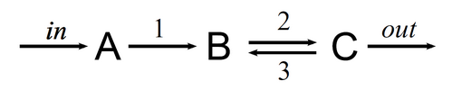

---
jupytext:
  text_representation:
    extension: .md
    format_name: myst
    format_version: 0.13
    jupytext_version: 1.11.5
kernelspec:
  display_name: Python 3 (ipykernel)
  language: python
  name: python3
---

```{code-cell} ipython3
%matplotlib inline
from matplotlib import pyplot as plt
if 'seaborn-whitegrid' in plt.style.available:
    seaborn_whitegrid, seaborn_talk = 'seaborn-whitegrid', 'seaborn-talk'
else:
    seaborn_whitegrid, seaborn_talk ='seaborn-v0_8-whitegrid', 'seaborn-v0_8-talk'
plt.style.use([seaborn_whitegrid, seaborn_talk,
              {'xaxis.labellocation': 'right',
               'legend.frameon': True,
               'figure.figsize': (10, 8),
               'legend.facecolor': 'white'}])
```

# Models and model description

+++

This chapter will focus on the "mini-language" used to describe models in S-timator and also on the model objects created by function `read_model()`

```{code-cell} ipython3
import stimator as st
```

Picking up the last example from the previous chapter: the _open two-enzyme system_:



+++

Recall that the minimum components of a model declaration are:

- title
- reactions
- parameters
- init

```{code-cell} ipython3
model_description = """
title An open two-reaction chemical system

inflow: -> A, rate = kin
r1: A -> B, rate = k1 * A
r2: B -> C, rate = k2 * B - k3 * C
outflow: C ->, rate = kout * C

kin = 0.5
k1 = 0.1
k2 = 2
k3 = 1
kout = 0.2

init: (A = 0, B = 0, C = 0)
"""

m = st.read_model(model_description)
print(m)
```

## 2.1 - Reactions

+++

You can iterate over the reactions of a model:

```{code-cell} ipython3
for v in m.reactions:
    print (v)
```

Or, just to get the names:

```{code-cell} ipython3
for v in m.reactions:
    print (v.name)
```

A reaction has a lot of attributes:

```{code-cell} ipython3
v = m.reactions.r1
print (v.name)
print (v.reagents)
print (v.products)
print (v.stoichiometry_string)
print (v.stoichiometry)
print (v())
```

`Model.varnames` is a list of variable names and `Model.parameters` can be used to iterate over the parameters of a model.

```{code-cell} ipython3
print (m.varnames)
for p in m.parameters:
    print ('%6s = %g' % (p.name, p))
```

## 2.2 - Transformations

+++

Transformations are declared starting a line with a `~`. These are quantities that vary over time but are not decribed by differential equations. In this example `total` is a transformation.

```{code-cell} ipython3
model_description = """
title An open two-reaction chemical system

inflow: -> A, rate = kin
r1: A -> B, rate = k1 * A
r2: B -> C, rate = k2 * B - k3 * C
outflow: C ->, rate = kout * C

kin = 0.5
k1 = 0.1
k2 = 2
k3 = 1
kout = 0.2

init: (A = 0, B = 0, C = 0)

~ total = A + B + C
"""

m = st.read_model(model_description)
print(m)
```

```{code-cell} ipython3
m.solve(tf=50.0, outputs=["total", 'A', 'B', 'C']).plot();
```

## 2.3 - Local parameters in processes

+++

Parameters can also "belong", that is, being local, to processes. 

In this example, both `r1` and `r2` have local parameters

Notice how thes paraemters are listed and refered to in `print m`:

```{code-cell} ipython3
model_description = """
title An open two-reaction chemical system

inflow: -> A, rate = kin
r1: A -> B, rate = k * A, k = 0.1
r2: B -> C, rate = kf * B - kr * C, kf = 2, kr = 1
outflow: C ->, rate = kout * C

kin = 0.5
kout = 0.2

init: (A = 0, B = 0, C = 0)

~ total = A + B + C
"""

m = st.read_model(model_description)
print(m)
```

But this model is exactly the same has the previous model. The parameters were just made local. (`plot()` produces the same results).

```{code-cell} ipython3
m.solve(tf=50.0, outputs=["total", 'A', 'B', 'C']).plot(xlabel='$t$', ylabel='concentrations');
```

The iteration of the parameters is now different:

```{code-cell} ipython3
for p in m.parameters:
    print(p.name, p)
```

## 2.4 - External variables

+++

An external variable is a parameter that appears in the stoichiometry of a reaction. It is treated as a constant.

In this example, `D` is an external variable:

```{code-cell} ipython3
m = st.read_model("""
title An open two-reaction chemical system

inflow: D -> A, rate = kin * D
r1: A -> B, rate = k * A, k = 0.1
r2: B -> C, rate = kf * B - kr * C, kf = 2, kr = 1
outflow: C -> E, rate = kout * C

D = 1
kin = 0.5
kout = 0.2
E = 2

init: (A = 0, B = 0, C = 0)

~ total = A + B + C
""")
print(m)
```

```{code-cell} ipython3
m.solve(tf=50.0, outputs=['A', 'B', 'C', 'D', 'E']).plot();
```

## 2.5 - Declaration of outputs

+++

You can use `!!` to specify what should go into the solution of the model:

```{code-cell} ipython3
m = st.read_model("""
title An open two-reaction chemical system

inflow: D -> A, rate = kin * D
r1: A -> B, rate = k * A, k = 0.1
r2: B -> C, rate = kf * B - kr * C, kf = 2, kr = 1
outflow: C -> E, rate = kout * C

D = 1
kin = 0.5
kout = 0.2
E = 2

init: (A = 0, B = 0, C = 0)

~ total = A + B + C

!! C D E
""")
m.solve(tf=50.0).plot();
```

Or use the `outputs` argument to the `solve()` function (in the form of a list of desired outputs):

```{code-cell} ipython3
m.solve(tf=50.0, outputs=['total', 'A']).plot();
```

`->` can be used to specify the values of all the rates of all the processes.

```{code-cell} ipython3
m.solve(tf=50.0, outputs=['->', 'D']).plot(palette='Set1');
```

## 2.6 - Explicit differential equations

```{code-cell} ipython3
m = st.read_model("""
title mass on a spring, frictionless

# F = m * a = m * v' = - k * x
# by Hooke's law and Newton's law of motion

v' = -(k * x) / m
x' = v

m = 0.5
k = 1

init: x = 1
""")
m.solve(tf=10.0).plot();
```

```{code-cell} ipython3
m = st.read_model("""
title mass on a spring, with friction

# using Hooke's law and friction proportional to speed,
# F = m * a = m * v' = - k * x - b * v

v' = (-k*x - b*v) / m
x' = v

m = 0.5
k = 1
b = 0.5

init: x = 1
""")
m.solve(tf=10.0).plot();
```

## 2.7 - Forcing functions

```{code-cell} ipython3
m = st.read_model("""
title An open two-reaction chemical system

inflow: D -> A, rate = kin * D * step(t, 10, 1)
r1: A -> B, rate = k * A, k = 0.1
r2: B -> C, rate = kf * B - kr * C, kf = 2, kr = 1
outflow: C -> E, rate = kout * C

D = 1
kin = 0.5
kout = 0.2
E = 2

init: (A = 0, B = 0, C = 0)

!! inflow A B C E
""")
m.solve(tf=80).plot(palette='Set1', legend='out', xlim=(0, 80));
```

