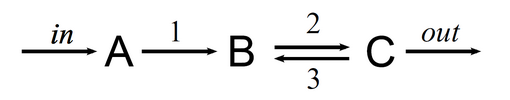

# Models and model description


This chapter will focus on the "mini-language" used to describe models in S-timator.

As we saw in the last chapter, we should start by importing `S-timator`:

```py exec="true" source="above" session="defmodels"
import stimator as st
```

Picking up the last example from the previous chapter: the _open two-enzyme system_:



Recall that the minimum components of a model declaration are:

- title
- reactions
- parameters
- init

```py exec="true" source="above" session="defmodels" result="txt"
model_description = """
title An open two-reaction chemical system

inflow: -> A, rate = kin
r1: A -> B, rate = k1 * A
r2: B -> C, rate = k2 * B - k3 * C
outflow: C ->, rate = kout * C

kin = 0.5
k1 = 0.1
k2 = 2
k3 = 1
kout = 0.2

init: (A = 0, B = 0, C = 0)
"""

m = st.read_model(model_description)
print(m)
```

## Reactions

`Model` objects, resulting from the function `read_model()`, expose different ways to extract information from a model.

For instance, we can iterate over the *reactions* of a model:

```py exec="true" source="above" session="defmodels" result="txt"
for v in m.reactions:
    print (v)
```

Or, just to get the names of those *reactions*:

```py exec="true" source="above" session="defmodels" result="txt"
for v in m.reactions:
    print (v.name)
```

A single reaction can be retrieved as an attribute of `reactions`.

Furtermore, a single reaction has, in turn, a lot of attributes.

Exploring these attributes for reaction `r1` we get:

```py exec="true" source="above" session="defmodels" result="txt"
v = m.reactions.r1
print (v.name)
print (v.reagents)
print (v.products)
print (v.stoichiometry_string)
print (v.stoichiometry)
print (v())
```

## Variable names and parameters

`Model.varnames` is a list of variable names:

```py exec="true" source="above" session="defmodels" result="txt"
print (m.varnames)
```

 `Model.parameters` can be used to iterate over the parameters of a model, in a way similar to `Model.reactions`. Each parameter name can be accessed by using the `.name` attribute:

```py exec="true" source="above" session="defmodels" result="txt"
for p in m.parameters:
    print(f"{p.name} = {p}")
```

## Transformations

Transformations are quantities that vary over time but are not described by differential equations.

Transformations are declared starting a line with a `~`.

In the following modification to our model we add `total` as a transformation. It represents the "pool" `A + B + C`

```py exec="true" source="above" session="defmodels" result="txt"
model_description = """
title An open two-reaction chemical system

inflow: -> A, rate = kin
r1: A -> B, rate = k1 * A
r2: B -> C, rate = k2 * B - k3 * C
outflow: C ->, rate = kout * C

kin = 0.5
k1 = 0.1
k2 = 2
k3 = 1
kout = 0.2

init: (A = 0, B = 0, C = 0)

~ total = A + B + C
"""

m = st.read_model(model_description)
print(m)
```

Transformations can be computed as part of the solution of a model:

```py exec="true" session="defmodels" html="1" source="above"
# matplotlib is being used as the plotting backend
import matplotlib.pyplot as plt

# setup S-timator styles for plots
st.style.use(['st-seaborn-whitegrid', 'seaborn-talk'])

from io import StringIO # markdown-exec: hide

f, ax = plt.subplots() # markdown-exec: hide
m.solve(tf=50.0, outputs=["total", 'A', 'B', 'C']).plot()

# plt.show() # uncomment if generating plots from a Python script

buffer = StringIO() # markdown-exec: hide
f.savefig(buffer, format="svg") # markdown-exec: hide
print(buffer.getvalue()) # markdown-exec: hide
```


## Local parameters in processes

Parameters are, generally, "global" to the model and can be used in the definitions of rates of reactions and transformations.

Parameters can also "belong", be "local" to processes. 

In the following example, both `r1` and `r2` have *local* parameters

Notice how these parameters are listed and refered to in `print(m)`:

```py exec="true" source="above" session="defmodels" result="txt"
model_description = """
title An open two-reaction chemical system

inflow: -> A, rate = kin
r1: A -> B, rate = k * A, k = 0.1
r2: B -> C, rate = kf * B - kr * C, kf = 2, kr = 1
outflow: C ->, rate = kout * C

kin = 0.5
kout = 0.2

init: (A = 0, B = 0, C = 0)

~ total = A + B + C
"""

m = st.read_model(model_description)
print(m)
```

This model is exactly the same has the previous model. The parameters were just made local. (`solve()`and `plot()` produce the same result).

```py exec="true" session="defmodels" html="1" source="above"
plt.close() # markdown-exec: hide
f, ax = plt.subplots() # markdown-exec: hide

tc = m.solve(tf=50.0, outputs=["total", 'A', 'B', 'C'])

tc.plot(xlabel='$t$', ylabel='concentrations')

buffer = StringIO() # markdown-exec: hide
f.savefig(buffer, format="svg") # markdown-exec: hide
print(buffer.getvalue()) # markdown-exec: hide
```

The iteration of the parameters is now a bit different. Notice the change in the names:

```py exec="true" source="above" session="defmodels" result="txt"
for p in m.parameters:
    print(f"{p.name} = {p}")
```

## External variables

An external variable is a parameter that appears in the stoichiometry of a reaction. It is treated as a constant.

In this example, `D` is an external variable. It appears in the stoichiometry of `inflow` but it also has a value declared as a parameter, `D = 1`.

```py exec="true" source="above" session="defmodels" result="txt"
m = st.read_model("""
title An open two-reaction chemical system

inflow: D -> A, rate = kin * D
r1: A -> B, rate = k * A, k = 0.1
r2: B -> C, rate = kf * B - kr * C, kf = 2, kr = 1
outflow: C -> E, rate = kout * C

D = 1
kin = 0.5
kout = 0.2
E = 2

init: (A = 0, B = 0, C = 0)

~ total = A + B + C
""")
print(m)
```

```py exec="true" session="defmodels" html="1" source="above"
plt.close() # markdown-exec: hide
f, ax = plt.subplots() # markdown-exec: hide

m.solve(tf=50.0, outputs=['A', 'B', 'C', 'D', 'E']).plot()

buffer = StringIO() # markdown-exec: hide
f.savefig(buffer, format="svg") # markdown-exec: hide
print(buffer.getvalue()) # markdown-exec: hide
```

## Declaration of outputs

**outputs**, the entities that are computed and retained in the solution time course, can be specified in the
`outputs` argument of function `solve()`.

They can also be declared in the model definition by using `!!` followed by a list of names of what should go into the solution of the model:

```py exec="true" session="defmodels" html="1" source="above"
plt.close() # markdown-exec: hide
f, ax = plt.subplots() # markdown-exec: hide

m = st.read_model("""
title An open two-reaction chemical system

inflow: D -> A, rate = kin * D
r1: A -> B, rate = k * A, k = 0.1
r2: B -> C, rate = kf * B - kr * C, kf = 2, kr = 1
outflow: C -> E, rate = kout * C

D = 1
kin = 0.5
kout = 0.2
E = 2

init: (A = 0, B = 0, C = 0)

~ total = A + B + C

!! C D E
""")

m.solve(tf=50.0).plot()

buffer = StringIO() # markdown-exec: hide
f.savefig(buffer, format="svg") # markdown-exec: hide
print(buffer.getvalue()) # markdown-exec: hide
```


Using the `outputs` argument of `solve()` overides the list declared in the model:

```py exec="true" session="defmodels" html="1" source="above"
plt.close() # markdown-exec: hide
f, ax = plt.subplots() # markdown-exec: hide

m.solve(tf=50.0, outputs=['total', 'A']).plot()

buffer = StringIO() # markdown-exec: hide
f.savefig(buffer, format="svg") # markdown-exec: hide
print(buffer.getvalue()) # markdown-exec: hide
```

`->` can be used to specify the values of all the rates of all the processes.

```py exec="true" session="defmodels" html="1" source="above"
plt.close() # markdown-exec: hide
f, ax = plt.subplots() # markdown-exec: hide

m.solve(tf=50.0, outputs=['->', 'D']).plot(palette='Set1')

buffer = StringIO() # markdown-exec: hide
f.savefig(buffer, format="svg") # markdown-exec: hide
print(buffer.getvalue()) # markdown-exec: hide
```

## Explicit differential equations

Instead of using "reactions", we can specify the rates of change by explicitly declaring the ODE of a variable.

We just need to append `'` to the name of the variable to indicate that the rhs is the expression for the ODE of a variable:

```py exec="true" session="defmodels" html="1" source="above"
plt.close() # markdown-exec: hide
f, ax = plt.subplots() # markdown-exec: hide

m = st.read_model("""
title mass on a spring, frictionless

# F = m * a = m * v' = - k * x
# by Hooke's law and Newton's law of motion

v' = -(k * x) / m
x' = v

m = 0.5
k = 1

init: x = 1
""")

m.solve(tf=10.0).plot()

buffer = StringIO() # markdown-exec: hide
f.savefig(buffer, format="svg") # markdown-exec: hide
print(buffer.getvalue()) # markdown-exec: hide
```

Another example:

```py exec="true" session="defmodels" html="1" source="above"
plt.close() # markdown-exec: hide
f, ax = plt.subplots() # markdown-exec: hide

m = st.read_model("""
title mass on a spring, with friction

# using Hooke's law and friction proportional to speed,
# F = m * a = m * v' = - k * x - b * v

v' = (-k*x - b*v) / m
x' = v

m = 0.5
k = 1
b = 0.5

init: x = 1
""")

m.solve(tf=10.0).plot()

buffer = StringIO() # markdown-exec: hide
f.savefig(buffer, format="svg") # markdown-exec: hide
print(buffer.getvalue()) # markdown-exec: hide
```

## Forcing functions

**Forcing functions** are time-varying functions that can be used to impose an explicit variation as part of the definition of the rate of a reaction or transformation.

### step function

In the following example we use the forcing function `step()` to simulate the sudden change of the inflow rate in the
*two-reaction* example. `step()` is a function of time `t` and has two other arguments, the time at which the step is applied and the new value of the function (a zero value before that time is implied).

```py exec="true" session="defmodels" html="1" source="above"
plt.close() # markdown-exec: hide
f, ax = plt.subplots() # markdown-exec: hide

m = st.read_model("""
title An open two-reaction chemical system

inflow: D -> A, rate = kin * D * step(t, 10, 1)
r1: A -> B, rate = k * A, k = 0.1
r2: B -> C, rate = kf * B - kr * C, kf = 2, kr = 1
outflow: C -> E, rate = kout * C

D = 1
kin = 0.5
kout = 0.2
E = 2

init: (A = 0, B = 0, C = 0)

!! inflow A B C E
""")
tc = m.solve(tf=80)

tc.plot(palette='Set1', legend='out', xlim=(0, 80));

buffer = StringIO() # markdown-exec: hide
f.savefig(buffer, format="svg") # markdown-exec: hide
print(buffer.getvalue()) # markdown-exec: hide
```

Notice how **inflow** has the form of a *step* function.

### square pulse

A *square pulse* can also be used in the expression of a forcing function:

```py exec="true" session="defmodels" html="1" source="above"
plt.close() # markdown-exec: hide
f, ax = plt.subplots() # markdown-exec: hide

m = st.read_model("""
title An open two-reaction chemical system

inflow: D -> A, rate = kin * D * sqrpulse(t, 20, 60)
r1: A -> B, rate = k * A, k = 0.1
r2: B -> C, rate = kf * B - kr * C, kf = 2, kr = 1
outflow: C -> E, rate = kout * C

D = 1
kin = 0.5
kout = 0.2
E = 2

init: (A = 0, B = 0, C = 0)

!! inflow A B C E
""")
tc = m.solve(tf=120)

tc.plot(palette='Set1', legend='out', xlim=(0, 120));

buffer = StringIO() # markdown-exec: hide
f.savefig(buffer, format="svg") # markdown-exec: hide
print(buffer.getvalue()) # markdown-exec: hide
```


